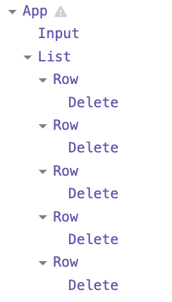

# Project 1 : Todo

1. 컴포넌트 구성 단계
    * 컴포넌트 분리
        * `App` : 전체 틀
            * `Input` : 사용자 입력과 버튼
            * `List` : Todo 데이터 테이블
                * `Row` : Todo 데이터 하나
                    * `Delete` : 사용자 Todo 데이터 삭제 버튼

2. 정적버전 구현
    ```js
    const exampleTodo = [
        {id:0, text:"밥먹기"},
        {id:1, text:"놀기"},
        {id:2, text:"야구하기"},
        {id:3, text:"쇼핑하기"},
        {id:4, text:"공부하기"}
    ];
    ```
    다음 데이터를 이용해, 구현한 컴포넌트 및 UI이다.
    
    

3. state 정리하기
    * ~~todoList~~ : 계산해서 보여주므로 `state`가 아니다.
    * 유저 입력 및 제출
    * ~~삭제 버튼~~ : 변하지 않으므로 `state`가 아니다.

4. state 위치찾기
    * 유저 입력 및 제출 : `App`에서 관리
    
5. 역방향 데이터 흐름 추가하기
    * Input으로 부터 입력받는 텍스트 체인지와 제출을 바인딩해 이벤트를 제어한다.

