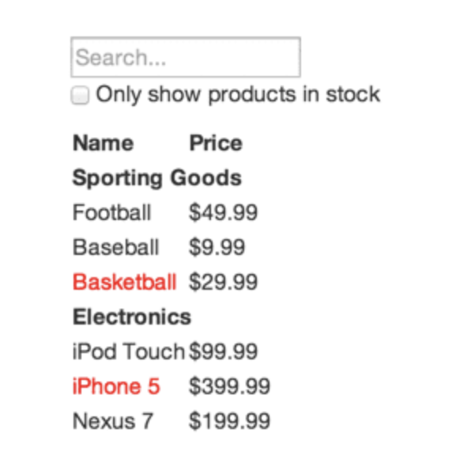

# Project 0 : Show Prize

* 데이터베이스로부터 받은 상품 테이블이 있다고 가정할 때, UI를 구성하고 검색창을 구현하라.
    ```js
    const goods = [
    {category: "Sporting Goods", price: "$49.99", stocked: true, name: "Football"},
    {category: "Sporting Goods", price: "$9.99", stocked: true, name: "Baseball"},
    {category: "Sporting Goods", price: "$29.99", stocked: false, name: "Basketball"},
    {category: "Electronics", price: "$99.99", stocked: true, name: "iPod Touch"},
    {category: "Electronics", price: "$399.99", stocked: false, name: "iPhone 5"},
    {category: "Electronics", price: "$199.99", stocked: true, name: "Nexus 7"}
    ];
    ```
    ***
    **결과**
    

1. **제공받은 UI에 대해서 컴포넌트 계층으로 분리하라.**
    * 분리한 컴포넌트들의 이름과 기능을 정의하자.
        * `App` : 전체 영역을 보여줍니다.
        * `SearchBar` : 사용자 입력을 받습니다.
        * `ProductTable` : 유저 입력을 기반으로 데이터 콜렉션을 필터해서 최종적으로 보여줍니다.
        * `ProductCategoryRow` : 각 `Category` 의 헤딩을 보여줍니다.
        * `ProductRow` : 각 `product` 행을  보여줍니다.

    * 분리한 컴포넌트를 계층 구조로 나열하자.
        * App
            * SearchBar
            * ProductTable
                * ProductCategoryRow
                * ProductRow
                
2. **정적버전을 먼저 만들어라.**
    * 정적 버전을 만들기 위해 `state`를 사용하지 않고 틀을 만들자.
        > 상향식 혹은 하향식으로 만드는 것은 자유이나, 큰 프로젝트에서는 상향식으로 만들고 테스트를 작성하면서 진행하는 것이 더 쉽다.

3. **UI state에 대한 데이터를 정리하라.**
    * 상품을 보여주는 이 애플리케이션의 데이터들은 다음과 같다.
        * 제품의 원본 목록
        * 유저가 입력한 검색어
        * 체크박스의 값
        * 필터링된 제품 목록
    * 각 데이터들에 대해서 세 질문을 통해 `state`가 되어야할 데이터들을 정리한다.
        * 시간이 지나도 변하지 않는다면 `state`가 아니다.
            -> 이 프로젝트에서 **제품의 원본 목록**은 시간이 지나도 변하지 않을 것이다.
        * 부모로부터 `props`를 통해 전달되면 `state`가 아니다.
            -> 마찬가지로 **제품의 원본 목록**은 `props`를 통해 전달될 것이다.
        * 컴포넌트 안의 다른 `state`나 `props`를 가지고 계산이 가능하다면 아니다.
            -> **필터링된 제품 목록**은 제품의 원본 목록과 검색어, 체크박스의 값을 조합해서 계산할 수 있다.
    * 결과적으로 `state`는 **유저가 입력한 검색어**와 **체크박스의 값** 두개만 적용하면 된다.

4. **State 위치 찾기**
    * 최소한의 `state`는 일반적으로 다음과 같은 규칙을 통해 위치를 선정할 수 있다.
        * `state`를 기반으로 렌더링하는 모든 컴포넌트를 찾는다.
        * 공통 부모 컴포넌트가 `state`를 가져야 한다.
        * `state`를 소유할 컴포넌트를 찾지 못했다면, 단순히 `state`만을 위한 컴포넌트를 만들어 공통 부모 컴포넌트 상위 계층에 추가한다.
    * `ProductTable` 컴포넌트는 각각 `state`에 의존한 상품 리스트를 필터링 할것이고, `SearchBar` 컴포넌트는 검색어와 체크박스의 상태를 표시해야 한다. 그러므로 공통 부모 컴포넌트인 `App` 컴포넌트에 `constructor`로 `state`를 지정한다. 이후, 자식 컴포넌트에게 `prop`를 전달한다.

5. **역방향 데이터 흐름 추가하기**
    * 계층 구조 아래로 흐르는 `props`와 `state`를 만들었다면, 자식이 부모로부터 콜백을 전달하는 데이터 흐름을 만들어야 한다.
    * `App` 컴포넌트로부터 `state`를 제어하고 업데이트 시키기 위해서 `SearchBar`의 `input` 태그에 있는 `onChange` 이벤트를 사용하여 콜백을 전달하고 결과적으로 `App` 컴포넌트의 `setState()`를 호출할 것이다.
